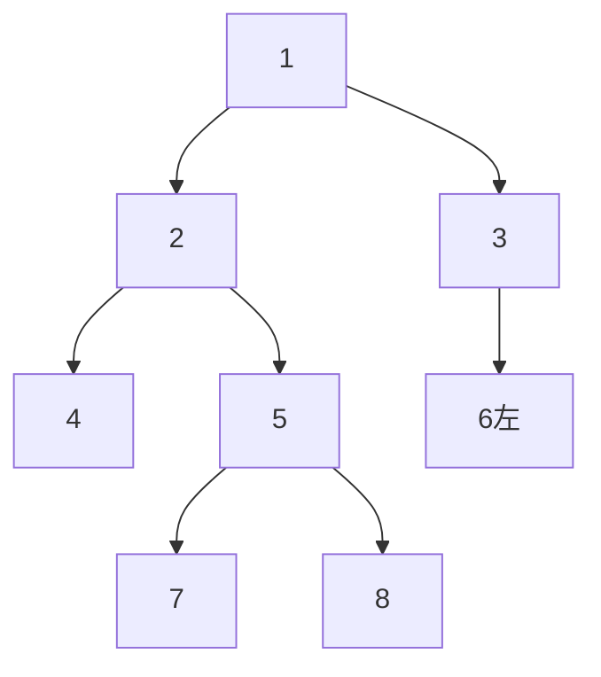

**声明：文中出现的题目均来自leetcode网站，https://leetcode-cn.com/**

# 二叉树

# 思路

关于二叉树，我们需要的了解到的点有很多。

例如二叉树的遍历方式，二叉搜索树，完全二叉树，满二叉树，平衡二叉树，红黑树等等。

这些都是学习二叉树的必备前置的知识。尽管可能在写算法的时候并不一定能运用上去，但是却能保证读懂题意。

这里并不会对这些知识详细展开，但是不意味着不重要。

关于二叉树的表示，其实在却大部分情况下（非完全二叉树），那么想表示一个二叉树，通常是使用结点的方式，也就是

```java
public class TreeNode {
        int val;//结点的值
        TreeNode left;//左孩子指针
        TreeNode right;//右孩子指针
}
```

我们利用图来进行一个说明


对于图中的每一个结点都有一个值，那就是他们结点的val，

再看看那些在上面的结点，他们的左下右下都有结点，其实就是他的**左孩子结点**和**右孩子结点**。

而对于这些**左孩子结点**和**右孩子结点**，该节点就是他们的**父亲结点**。

而拥有**同一个父亲结点**的**结点**，相互为**兄弟结点**。

而图上没有**连接孩子结点**的那些**结点**，其实对应的**孩子结点指针**就是**null**。

而在二叉树的**顶端**，只有一个结点，这个结点就是**根节点**。

我们通过这个根节点，就可以遍历这棵树。

所以通常返回一颗二叉树，或者是题目给定一颗二叉树绝大部分情况下都是使用根节点返回。

不过并不是说表示二叉树的方式 只能是返回根节点的方式，其实这里也是可以使用数组的方式。使用数组表示二叉树的方式通常只适用完全二叉树，再算法中运用较少，这里不做介绍。

**完全二叉树**就是除了最后一层，每一层结点都是满的，且最后一层结点靠左都是满的。

# 遍历方式

## 遍历顺序

#### 先序遍历

顺序：根节点-->左子树-->右子树

#### 中序遍历

顺序：左子树-->根节点-->右子树

#### 后序遍历

顺序：左子树-->右子树-->根节点

#### 层次遍历

顺序：按照层次遍历

## 图示



* 前序遍历

  1 2 4 5 7 8 3 6

* 中序遍历

   4 2 7 5 8 1 6 3

* 后序遍历

  4 7 8 5 2 6 3 1

* 层次遍历

  1 2 3 4 5 6 7 8

## 前序算法

根节点->左子树->右子树

### 迭代

* 根据前序遍历的特性，我们应该是从根节点一直向左子树遍历，并且一直将遇到的节点表示出来，直到该结点没有左子树

* 当该节点没有左子树时，我们取该结点的右结点，

* 如果右节点不为null，将继续以上操作，

* 如果右节点为空，将继续判断该节点的父节点是否有右子树。

利用栈的思想：

* 从根节点开始，一直往左遍历，遍历时一直往**栈里添加**结点，**这个时候记录结点**，

* 添加直到结点没有左子树

* 这个时候将栈顶的结点**出栈**（也就是当前结点），去获得它的右结点

  **注：由于栈的特性，我们会发现这个结点已经不再栈中**

  * **其实这个栈的作用就是去记录还未访问右节点的结点**
  * **当我们选择出栈，就意味着我们即将对其右子树操作**
  * **也就是相关与这个结点的操作我们已经完成**

* 如果没有右节点，我们将会继续出栈，继续访问新出栈的右节点。

* 如果有右节点，将会重复以上操作（继续往左遍历）

问题：利用前序算法

```java
/**
 * Definition for a binary tree node.
 * public class TreeNode {
 *     int val;
 *     TreeNode left;
 *     TreeNode right;
 *     TreeNode() {}
 *     TreeNode(int val) { this.val = val; }
 *     TreeNode(int val, TreeNode left, TreeNode right) {
 *         this.val = val;
 *         this.left = left;
 *         this.right = right;
 *     }
 * }
 */
class Solution {
    public List<Integer> preorderTraversal(TreeNode root) {
        List<Integer> list=new ArrayList<Integer>();
        Stack<TreeNode> stack=new Stack<TreeNode>();
        if(root==null) return list;
        TreeNode node=root;
        while(node!=null||!stack.empty()){
            //添加结点的值并且一直往左子树遍历
            while(node!=null){
                list.add(node.val);
                stack.push(node);
                node=node.left;
            }
            //查看右子树，出栈表示这个结点已经遍历了左子树和即将遍历右子树
            //也就是不会在对tem这个结点进行操作了
            TreeNode tem=stack.pop();
            node=tem.right;
        }
        return list;
    }
}
```

### 递归

```java
class Solution {
    public List<Integer> preorderTraversal(TreeNode root) {
        List<Integer> list=new ArrayList<Integer>();
        if(root==null) return list;
       pp(root,list);
        return list;
    }
    public static void pp(TreeNode node, List<Integer> list){
        if(node==null)return ;
        list.add(node.val);
        pp(node.left,list);
        pp(node.right,list);
    }

}
```

## 中序算法

左子树-->根节点-->右子树

### 迭代

* 根据中序遍历的特性，我们也是是从根节点一直向左子树遍历，直到该结点**没有左子树**，我们**记录**下来
* 当**该节点**有右子树时(此时该节点应当被视为父亲节点)，继续查看它右节点（然后继续以上操作，将右结点视为根节点进行操作）
* 如果它右节点为null，返回**该节点**的父节点
* 然后父节点判断其是否有右节点

利用栈的思想：

* 从根节点开始，一直往左遍历，遍历时一直往栈里添加结点，直到结点没有左子树。

* 这个时候将栈顶的结点出栈（也就是当前结点），**这个时候记录该节点**，

* 去获得该节点的右结点

  **注：其实这里的操作和前序迭代遍历的注意点是类似的**

  * **区别是记录节点的位置**

* 如果没有右节点，我们将会继续出栈，继续访问新出栈的右节点。

* 如果有右节点，将会重复以上操作（继续往左遍历）

```java
/**
 * Definition for a binary tree node.
 * public class TreeNode {
 *     int val;
 *     TreeNode left;
 *     TreeNode right;
 *     TreeNode() {}
 *     TreeNode(int val) { this.val = val; }
 *     TreeNode(int val, TreeNode left, TreeNode right) {
 *         this.val = val;
 *         this.left = left;
 *         this.right = right;
 *     }
 * }
 */
class Solution {
    public List<Integer> inorderTraversal(TreeNode root) {
        List<Integer> list=new ArrayList<Integer>();
        Stack<TreeNode> stack=new Stack<TreeNode>();
        if(root==null)return list;
        TreeNode tem=root;
        while(!stack.empty()||tem!=null){
            while(tem!=null){
                stack.push(tem);
                tem=tem.left;
            }
            TreeNode node= stack.pop();
            list.add(node.val);
            tem=node.right;
        }
        return  list;
    }
}
```

### 递归

```java
class Solution {
    public List<Integer> preorderTraversal(TreeNode root) {
        List<Integer> list=new ArrayList<Integer>();
        if(root==null) return list;
       pp(root,list);
        return list;
    }
    public static void pp(TreeNode node, List<Integer> list){
        if(node==null)return ;
        pp(node.left,list);
        list.add(node.val);
        pp(node.right,list);
    }

}
```

## 后序算法

左子树-->右子树-->根节点

### 迭代

* 根据后序遍历的特性，我们也是从根节点一直向左子树遍历，直到该结点没有左子树
* 当该节点有右子树时，继续查看右节点（然后继续以上操作，将右结点视为根节点进行操作）
* 如果该节点没有右子树，记录该节点，返回父节点，反复

利用栈的思想：

* 从根节点开始，一直往左遍历，遍历时一直往栈里添加结点，直到结点没有左子树

* 这个时候将栈顶的结点**出栈**（也就是当前结点）

  **注（区别）：由于栈的特性，我们会发现这个结点已经不再栈中**

  * 与前序和中序遍历不同，后序遍历根节点是最后记录
  * 所以我们需要判断该节点**是否有右子树**或者是**右子树是否遍历完成**
  * 如果有右子树且右子树未遍历
    * 将该节点再次**入栈**
    * 遍历右子树
  * 当右子树遍历完成遍历完成，我们才**出栈且记录根节点**
  * **也就是相关与这个结点的操作我们已经完成**

* 如果**没有右节点或者右节点遍历完成**，**记录该节点**，我们将出栈，继续访问新出栈节点的右节点。

* 如果有右节点，将会重复以上操作（继续往左遍历）

```java
/**
 * Definition for a binary tree node.
 * public class TreeNode {
 *     int val;
 *     TreeNode left;
 *     TreeNode right;
 *     TreeNode() {}
 *     TreeNode(int val) { this.val = val; }
 *     TreeNode(int val, TreeNode left, TreeNode right) {
 *         this.val = val;
 *         this.left = left;
 *         this.right = right;
 *     }
 * }
 */
class Solution {
    public List<Integer> postorderTraversal(TreeNode root) {
        List<Integer> res = new ArrayList<Integer>();
        if (root == null) {
            return res;
        }
        Deque<TreeNode> stack = new LinkedList<TreeNode>();
        TreeNode visited=null;
        while (root != null || !stack.isEmpty()) {
            while (root != null) {
                stack.push(root);
                root = root.left;
            }
            root = stack.pop();  
            //此处判断是否有右子树
            //如果有右子树且右子树未遍历，就将根节点入栈，遍历右子树
            //否则记录节点
            if (root.right == null||root.right==visited ) {
                res.add(root.val);
                visited=root;
                root = null;
            } else {
                stack.push(root);
                root = root.right;
            }
        }
        return res;
    }
}
```

### 递归

```java
class Solution {
    public List<Integer> preorderTraversal(TreeNode root) {
        List<Integer> list=new ArrayList<Integer>();
        if(root==null) return list;
       	pp(root,list);
        return list;
    }
    public static void pp(TreeNode node, List<Integer> list){
        if(node==null)return ;
        pp(node.left,list);
        pp(node.right,list);
        list.add(node.val);
    }
}
```

## 层次遍历

层序遍历是典型的广度优先算法，利用队列的思想可以解决。

* 第一个根节点一定位于第一层，我们将它入队
* **记录当前的队列长度**，然后**根据长度遍历**当前队列结点的左右子节点，每查看一个就**出队**一个
* 遍历完，我们就会队列中就会**多出**当前这层的所有**子结点**，并且**出队**刚刚遍历完的**结点**
* 如果队空表示扫描完成

```java
/**
 * Definition for a binary tree node.
 * public class TreeNode {
 *     int val;
 *     TreeNode left;
 *     TreeNode right;
 *     TreeNode(int x) { val = x; }
 * }
 */
class Solution {
    public List<List<Integer>> levelOrder(TreeNode root) {
        List<List<Integer>> list =new ArrayList<List<Integer>>();
        Queue<TreeNode> queue= new LinkedList<TreeNode>();
        if(root==null) return list;
        queue.offer(root);
        while(!queue.isEmpty()){
            int size=queue.size();
            List<Integer> list2=new ArrayList<Integer>();
            for(int i=0;i<size;i++){
                TreeNode tem=queue.poll();
                list2.add(tem.val);
                if(tem.left!=null){
                    queue.offer(tem.left);
                }
                if(tem.right!=null){
                    queue.offer(tem.right);
                }
            }
            list.add(list2);
        }
        return list;
    }
}
```

# 经典题目

### 简单

#### 1 求二叉书的最大深度（题号104）

* 给定一个二叉树，找出其最大深度。
* 二叉树的深度为根节点到最远叶子节点的最长路径上的节数。
* 

#### 2 对称二叉树（题号101）

给定一个二叉树，检查它是否是镜像对称的。


#### 3 路经总和（题号112）

给定一个二叉树和一个目标和，判断该树中是否存在根节点到叶子节点的路径，这条路径上所有节点值相加等于目标和。

**说明:** 叶子节点是指没有子节点的节点。


#### 4 相同的树（题号100）

给你两棵二叉树的根节点 `p` 和 `q` ，编写一个函数来检验这两棵树是否相同。

如果两个树在结构上相同，并且节点具有相同的值，则认为它们是相同的。


思路:直接验证树是否相同时，我们的思路其实很简单的，就是验证每个结点的值是否相等。那么我们就可以利用递归来进行求解了。首先判断对应的位置是否有结点，如果一个树的某个位置有结点，另外一颗树没有结点，那么结果这两个树肯定是不相等的。接下来对对应位置有结点的，我们只需要比较他的值就行了。

```java
class Solution {
    public boolean isSameTree(TreeNode p, TreeNode q) {
        if(p==null&&q!=null||p!=null&&q==null)return false;
        if(p==null&& q==null)return true;
        boolean t1=p.val==q.val;
        boolean t2=isSameTree(p.left,q.left);
        boolean t3=isSameTree(p.right,q.right);
        return t1&&t2&&t3;
    }
}
```

#### 二叉搜索树的范围和（938）

给定二叉搜索树的根结点 `root`，返回值位于范围 *`[low, high]`* 之间的所有结点的值的和。


```java

class Solution {
    public int rangeSumBST(TreeNode root, int low, int high) {
        if(root==null)return 0;
        if(root.val>high){
            return rangeSumBST(root.left,low,high);
        }else if(root.val<low){
            return rangeSumBST(root.right,low,high);
        }else{
            return root.val+rangeSumBST(root.right,low,high)+rangeSumBST(root.left,low ,high);
        }
    }
}
```

#### 二叉树的堂兄弟结点（993）

在二叉树中，根节点位于深度 0 处，每个深度为 k 的节点的子节点位于深度 k+1 处。

如果二叉树的两个节点深度相同，但 父节点不同 ，则它们是一对堂兄弟节点。

我们给出了具有唯一值的二叉树的根节点 root ，以及树中两个不同节点的值 x 和 y 。

只有与值 x 和 y 对应的节点是堂兄弟节点时，才返回 true 。否则，返回 false。


思路：利用广度优先遍历

```java

class Solution {
    public boolean isCousins(TreeNode root, int x, int y) {
        int hx=findHight(x,root);
        int hy=findHight(y,root);
        if(hx!=hy)return false;
        TreeNode xp=findP(x,root);
        TreeNode yp=findP(y,root);
        if(xp!=yp)return true;
        return false;
    }
    public int findHight(int x,TreeNode root){
        Deque<TreeNode> deque=new LinkedList<TreeNode>();
        int height=0;
        deque.add(root);
        boolean flag=false;
        while(deque.size()>0){
            int size=deque.size();
            height++;
            for(int i=0;i<size;i++){
                TreeNode node=deque.pollFirst();
                if(node.val==x){
                    flag=true;
                    break;
                    }
                if(node.right!=null)deque.addLast(node.right);
                if(node.left!=null)deque.addLast(node.left);
            }
            if(flag){
                break;
            }
        }
        return height;
    }
    public TreeNode findP(int x,TreeNode root){
        Deque<TreeNode> deque=new LinkedList<TreeNode>();
        deque.add(root);
        while(deque.size()>0){
            int size=deque.size();
            for(int i=0;i<size;i++){
                TreeNode node=deque.pollFirst();
                if(node.right!=null){
                    if(node.right.val==x)return node;
                    deque.addLast(node.right);
                }
                if(node.left!=null){
                    if(node.left.val==x)return node;
                    deque.addLast(node.left);
                }
            }
        }
        return null;
    }
}
```


### 进阶

#### 1 利用中序遍历和后序遍历构造二叉树（题号106）


##### 解法一（标准解法）

思路：利用中序遍历和后序遍历的特征，来确定每个根结点的位置。

* 后序遍历的最后一个结点必为根节点
* 利用根节点的值到中序遍历就可以确定左右子树的范围
* 利用左右子树的范围，到后遍历的次序中确定左右子树范围，进而确定左右子树的根节点

这种思路比较适合利用递归来求解

```java
/**
 * Definition for a binary tree node.
 * public class TreeNode {
 *     int val;
 *     TreeNode left;
 *     TreeNode right;
 *     TreeNode(int x) { val = x; }
 * }
 */
class Solution {
    HashMap<Integer,Integer> map=new HashMap<Integer,Integer>();
    int[] postorder;
    public TreeNode buildTree(int[] inorder, int[] postorder) {
        TreeNode node=null;
        if(postorder.length==0||postorder==null)return node;
        for(int i=0;i<inorder.length;i++){
            map.put(inorder[i],i);
        }
        this.postorder=postorder;
        int length=postorder.length;
        node=tt(0,length-1,0,length-1);
        return  node;
    }
    public TreeNode tt(int begin,int end,int first,int last){
        if(begin>end||first>last)return null;
        int tem=postorder[last];
        TreeNode node=new TreeNode(tem);
        int center=map.get(tem);
        node.left=tt(begin,center-1,first,first-begin+center-1);
        node.right=tt(center+1,end,first-begin+center,last-1);
        return node;
    }
}
```


##### 解法二（优先构建右子树）

思路：根据后序遍历逻辑，递归创建右子树 helper(index + 1, in_right) 和左子树 helper(in_left, index - 1)。注意这里有需要先创建右子树，再创建左子树的依赖关系。可以理解为在后序遍历的数组中整个数组是先存储左子树的节点，再存储右子树的节点，最后存储根节点，如果按每次选择「后序遍历的最后一个节点」为根节点，则先被构造出来的应该为右子树。

```java
/**
 * Definition for a binary tree node.
 * public class TreeNode {
 *     int val;
 *     TreeNode left;
 *     TreeNode right;
 *     TreeNode(int x) { val = x; }
 * }
 */
class Solution {
    int index;
    int[] postorder;
    int post_idx;
    HashMap<Integer,Integer> map=new HashMap<Integer,Integer>();
    public TreeNode buildTree(int[] inorder, int[] postorder) {
        this.postorder=postorder;
        int len=postorder.length;
        for(int i=0;i<len;i++){
            map.put(inorder[i],i);
        }
        index=len-1;
        post_idx=index;
        return tt(0,len-1);
    } 
    public TreeNode tt(int left,int right){
        if(left>right)return null;
        int root_val=postorder[post_idx];
        TreeNode node=new TreeNode(root_val);
        int center=map.get(root_val);
        post_idx--;
        node.right=tt(center+1,right);
        node.left=tt(left,center-1);
        return node;
    }
}
```


#### 2 利用前序遍历和中序遍历构造二叉树（题号105）

##### 解法一（优先构建左子树）

方式类似利用**中序遍历和后序遍历构造二叉树**的**解法二**

```java
/**
 * Definition for a binary tree node.
 * public class TreeNode {
 *     int val;
 *     TreeNode left;
 *     TreeNode right;
 *     TreeNode(int x) { val = x; }
 * }
 */
class Solution {
    int[] preorder;
    HashMap<Integer,Integer> map=new HashMap<Integer,Integer>();
    int length;
    public TreeNode buildTree(int[] preorder, int[] inorder) {
        int len=preorder.length;
        for(int i=0;i<len;i++){
            map.put(inorder[i],i);
        }
        this.preorder=preorder;
        length=0;
        return tt(0,len-1);
    }
    public TreeNode tt(int left,int right){
        if(left>right)return null;
        int value=preorder[length++];
        int center=map.get(value);
        TreeNode node=new TreeNode(value);
        node.left=tt(left,center-1);
        node.right=tt(center+1,right);
        return node;
    }
}
```

#### 3 二叉树层序遍历2（107）

给定一个二叉树，返回其节点值自底向上的层序遍历。 （即按从叶子节点所在层到根节点所在的层，逐层从左向右遍历）


思路：参考二叉树的层序遍历就可以实现，区别就是结果的放入。这里不做赘述。

```java

class Solution {
    public List<List<Integer>> levelOrderBottom(TreeNode root) {
        List<List<Integer>> lists= new ArrayList<List<Integer>>();
        Deque<TreeNode> deque=new LinkedList<TreeNode>();
        if(root==null)return lists;
        deque.addLast(root);
        while(deque.size()>0){
            int size=deque.size();
            List<Integer> list=new ArrayList<Integer>();
            for(int i=0;i<size;i++){
                TreeNode node= deque.pollFirst();
                list.add(node.val);
                if(node.left!=null){
                    deque.addLast(node.left);
                }
                if(node.right!=null){
                    deque.addLast(node.right);
                }
            }    
            lists.add(0,list);
        }
        return lists;
    }
}
```


 